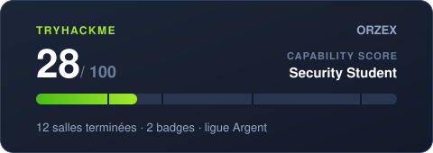
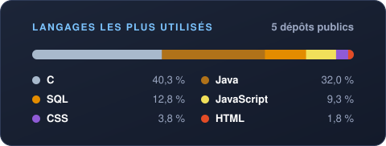

<h1 align="center">Enzo Buchaillat</h1>

  Étudiant en 2e année de BUT Informatique · attiré par la cybersécurité

  
  
  

## À propos

Je suis en 2e année de BUT Informatique à l'IUT de Caen. J'aime comprendre comment fonctionnent les systèmes de l'intérieur, et surtout comment on les attaque et comment on les protège : la **cybersécurité** est le domaine qui m'attire le plus. Je m'y forme en parallèle de mes cours, notamment sur [TryHackMe](https://tryhackme.com/p/ORZEX).

En dehors des cours, je construis aussi des projets perso pour pratiquer et apprendre des choses que je ne vois pas encore en classe.

## Ce qui m'intéresse

- **La sécurité des applications web** : authentification, contrôle d'accès, injections, gestion des secrets (OWASP Top 10)
- **Linux et la ligne de commande** : Bash, scripts, administration système
- **Les réseaux** : comprendre comment les machines communiquent, la base pour savoir comment on attaque et défend un système
- **Le fonctionnement bas niveau** : la programmation en C, la mémoire, ce qui se passe sous le capot

## Projets

### Projets d'école

- **[Viking Transport](https://github.com/EnzoBuchaillat/VikingTransport-sae-2.4-5-6)** : site de réservation de trajets réalisé en équipe de 7 pour une SAÉ, avec une recherche d'itinéraire par l'algorithme de Dijkstra (PHP, Oracle)
- **[Coursework](https://github.com/EnzoBuchaillat/Coursework)** : mes travaux de première année, en C, Java et SQL
- **[CourseJS](https://github.com/EnzoBuchaillat/CourseJS)** : mes exercices de développement web en HTML, CSS et JavaScript natifs
- **[js-memory-game](https://github.com/EnzoBuchaillat/js-memory-game)** : un jeu de Memory en JavaScript natif, sans framework ([démo en ligne](https://enzobuchaillat.github.io/js-memory-game/))

### Projets perso

- **[MacTidy](https://github.com/EnzoBuchaillat/MacTidy)** *(en cours)* : un utilitaire en ligne de commande, en Java, qui repère dans un dossier les fichiers lourds et inutilisés depuis longtemps pour aider à faire le tri sur son Mac. Je le code moi-même, étape par étape, pour progresser en Java en dehors des cours (lecture du système de fichiers, saisies utilisateur, gestion des erreurs).
- **[Dropresell](https://dropresell.com)** : une application web pour les vendeurs Vinted, construite avec l'aide de l'IA. Elle m'a surtout appris à mener un projet de bout en bout, de l'idée jusqu'à sa mise en ligne.

## Compétences

**J'ai les bases en**

  
  
  

**Réseau** : modèle OSI, TCP/IP, adressage IP, configuration et simulation de réseaux sur **Cisco Packet Tracer**

**Des notions en**

  

**Mes outils**

  

### Langages les plus utilisés

Calculé chaque semaine sur mes dépôts publics (hors forks), d'après le volume de code par langage.

## Me contacter

Une question, un projet ou une opportunité ? Écris-moi ou retrouve-moi sur LinkedIn.

  
  
  

